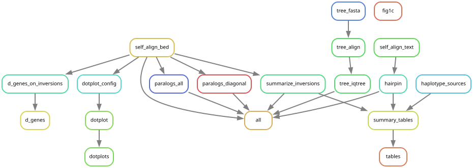

# Bird Immunoglobulin Locus Analysis

Analysis of IGH and IGL loci across bird species, focusing on V gene diversity,
inversion structure, RSS presence, D gene organisation, and phylogenetic patterns.

Project proposal: https://docs.google.com/document/d/1fQ5YY_o3Em4FCX1qUgj8X3SZHkFUl0uUHCLTdSHpsR0/edit?usp=sharing

---

## Repository structure

```
Bird_IG/
├── data_prep/          # Scripts to build the summary tables from raw gene files
├── RSS/                # RSS extraction and positional analysis
├── tree_analyses/      # Per-locus phylogenetic trees and tree-distance analyses
├── plots/              # R scripts for figures (run interactively in RStudio)
├── repeatmasker/       # RepeatMasker integration scripts
├── kmer_analysis/      # K-mer based analyses
├── within_species_inversions/  # Within-species inversion comparison scripts
└── *.py / *.R          # Top-level pipeline scripts (see workflow below)
```

---

## Data directory structure

All processed data lives under a single top-level directory (referred to as
`INPUT_DIR` throughout the scripts, typically `/local/storage/kav67/clean_birds/`).

```
INPUT_DIR/
├── summary_features.csv          # Master table: one row per haplotype × locus
│                                 # Columns: Order, Species, Haplotype, Locus, Contig, NumV
├── IGH_filtered_table.tsv        # IGH-only filtered subset of summary_features
├── IGH_VGP_table.tsv             # IGH table with added LatinName column (for tree matching)
├── gene_list.csv                 # All V genes across all species with RSS annotations
│                                 # Columns: Source (Order/Species/Haplotype), GeneType,
│                                 #          Contig, Pos, Strand, Sequence, Productive,
│                                 #          Locus, Heptamer, Nonamer, ...
├── vgp_birds.nwk                 # VGP bird species phylogenetic tree (Newick)
├── inversion_stats.tsv          # Inversion summary stats, one row per haplotype x contig
├── inversion_details.tsv        # Per-inversion details (length, diagonal flag, etc.)
├── D_inversions.tsv              # Output of d_genes_on_inversions.py
│
└── {Order}/                      # e.g. Doves/, Eagles/, Waterfowl/
    └── {Species}/                # e.g. Pink_Pigeon/
        └── {Haplotype}/          # e.g. bNesMay2_pri/  (pri = primary, alt = alternate)
            │
            ├── combined_genes_IGH_clean.txt   # Filtered IGH V genes (TSV)
            ├── combined_genes_IGL_clean.txt   # Filtered IGL V genes (TSV)
            │                                  # Columns: GeneType, Contig, Pos, Strand,
            │                                  #          Sequence, Productive, Locus
            ├── IGHD.csv                       # D genes for this haplotype
            │                                  # Columns: Source, GeneType, Contig, Pos,
            │                                  #          Strand, Sequence, Productive,
            │                                  #          Locus, ..., Location Relative to V-Cluster
            │
            ├── {Contig}_IGH.tsv              # LASTZ self-alignment output for IGH locus
            ├── {Contig}_IGH.bed              # Gene positions as BED (all genes, black)
            ├── {Contig}_IGH_strand.bed       # Gene positions as BED (- strand = grey)
            ├── {Contig}_IGL.tsv              # Same for IGL locus
            ├── {Contig}_IGL.bed
            ├── {Contig}_IGL_strand.bed
            │
            ├── refined_ig_loci/
            │   ├── summary.csv               # Locus boundaries: StartPos, EndPos per contig
            │   └── igloci_fasta/
            │       ├── IGH_{Contig}_{NumV}Vs.fasta   # Extracted IGH locus sequence
            │       └── IGL_{Contig}_{NumV}Vs.fasta   # Extracted IGL locus sequence
            │
            └── tree/
                ├── {Haplotype}.fasta                  # IGH V gene sequences (FASTA)
                ├── {Haplotype}_aligned.fasta          # IGH multiple sequence alignment
                ├── {Haplotype}_tree.treefile          # IGH IQ-TREE phylogeny
                ├── IGL_{Haplotype}.fasta              # IGL V gene sequences
                ├── IGL_{Haplotype}_aligned.fasta      # IGL multiple sequence alignment
                └── IGL_{Haplotype}_tree.treefile      # IGL IQ-TREE phylogeny
```

---

## Running the workflow (Snakemake)

Stages 2-5 (self-alignment, inversion summaries, paralogs, trees) are wired up as
a Snakemake workflow. Stage 1 (building `summary_features.csv` and the metadata
tables) and stages 6-8 (dotplots, publication tables, figures) are still run by
hand -- see the walkthrough below.

```
workflow/Snakefile          targets and the index
workflow/rules/align.smk    stage 2  LASTZ self-alignment + BED
workflow/rules/inversions.smk  stage 3  inversion stats, D genes, hairpin
workflow/rules/paralogs.smk    stage 4  inversion paralog groups
workflow/rules/trees.smk       stage 5  fasta -> clustalo -> iqtree2
config/config.yaml          input_dir, thresholds, loci
```

Everything runs in the `snakemake` conda env, which carries pandas plus `lastz`,
`clustalo` and `iqtree2`:

```bash
conda activate snakemake
snakemake -s workflow/Snakefile --configfile config/config.yaml -n
```

Partial targets, if you only want one stage:

```bash
snakemake -s workflow/Snakefile --configfile config/config.yaml --cores 20 align
snakemake -s workflow/Snakefile --configfile config/config.yaml --cores 20 inversions
snakemake -s workflow/Snakefile --configfile config/config.yaml --cores 20 paralogs
snakemake -s workflow/Snakefile --configfile config/config.yaml --cores 20 trees
```

### Profiles

Two profiles are provided, so the long flag lists do not have to be retyped:

```bash
# run directly on the node (64 cores, the usual choice)
snakemake -s workflow/Snakefile --configfile config/config.yaml \
          --profile workflow/profiles/local trees

# submit each job to Slurm
snakemake -s workflow/Snakefile --configfile config/config.yaml \
          --profile workflow/profiles/slurm trees
```

**Which to use.** `regular` is a *single* node (cbsupennell01, 256 CPUs / 2.3 TB),
and interactive sessions already run on that same node -- so going through Slurm
does **not** give more parallelism than the local profile. Use the Slurm profile
when you want jobs to queue politely alongside other lab members' work, want each
job's resource request enforced by cgroups, want failed jobs retried, or want the
run to show up in `sacct`. Use the local profile for everything else.

Per-rule `threads` and `resources` (`mem_mb`, `runtime`) are already set in the
rule definitions, so both profiles work without further configuration. Slurm logs
land in `logs/slurm/{rule}-{jobid}.{out,err}` (gitignored).

### Things to know before the first run

- **The index is an input, not a rule output.** `summary_features.csv` is read at
  parse time to build the wildcard lists, so it must exist first. Rebuild it with
  `data_prep/create_summary_tables_clean.R` whenever species are added, then re-run.
- **Rows with no locus FASTA are excluded and named.** The index lists some contigs
  that were never extracted. Most are `NumV` 1-2 (below IGDetective's threshold);
  any with `NumV >= min_numv` are printed as `[index] EXCLUDED ...` warnings and are
  worth chasing -- they are index/data mismatches, not expected gaps.
- **Existing outputs are respected.** Snakemake leaves up-to-date files alone;
  always check `-n` first. If a dry run proposes redoing work you want to keep,
  adopt the existing files with `--touch` rather than letting it re-run.
- **Never use `--forceall`.** Outputs live in `input_dir`, and a forced run would
  discard weeks of LASTZ and IQ-TREE work.

### Rulegraph



Regenerate after adding or changing rules:

```bash
snakemake -s workflow/Snakefile --configfile config/config.yaml --rulegraph \
  | dot -Tsvg > docs/rulegraph.svg
```

(`--rulegraph` shows the rules; `--dag` shows every job instance and is unreadable
at ~800 nodes.)

---

## Pipeline walkthrough

### Step 1 — Build summary tables (`data_prep/`)

Starting point: raw gene annotation files per species/haplotype.

| Script | What it does |
|--------|-------------|
| `data_prep/create_summary_features.R` | Creates `summary_features.csv` — the master table listing every haplotype × locus with its main contig and V gene count |
| `data_prep/create_summary_tables_clean.R` | Builds `IGH_filtered_table.tsv` and related filtered tables |
| `data_prep/filter_genes.py` | Filters and cleans raw gene files to produce `combined_genes_IGH_clean.txt` / `combined_genes_IGL_clean.txt` per haplotype |
| `data_prep/overview_features.R` | Filters species to those present in the VGP tree; produces data overview plots |
| `data_prep/assign_haplotype_source.py` | Classifies each haplotype's data source (VGP / CCGP / house finch, jay, or seedeater pangenome / unpublished) by querying the NCBI Datasets API for the assembly's BioProject lineage; writes `haplotype_sources.csv` |
| `data_prep/build_summary_tables.py` | Combines `summary_features.csv`, `gene_list.csv`, `inversion_stats.tsv`, `D_inversions.tsv`, `palindromes.tsv`, and `haplotype_sources.csv` into the publication-facing tables under `summary_tables/` (run after `assign_haplotype_source.py`) |

---

### Step 2 — Self-align loci and create BED annotation files

Each locus FASTA is aligned against itself with LASTZ to find inverted/repeated
regions. Gene positions are also written as BED files for visualisation.

| Script | What it does |
|--------|-------------|
| `self_alignment_bed.py` | Runs LASTZ self-alignment for every locus in `summary_features.csv` and writes `{Contig}_{Locus}.tsv`, `{Contig}_{Locus}.bed`, `{Contig}_{Locus}_strand.bed` per haplotype. Replaces the former `IGH_self_alignment_bed.py` / `IGL_self_alignment_bed.py` pair |

It takes:
- `-i INPUT_DIR` — top-level data directory
- `-s summary_features.csv` — master table (`.csv` and `.tsv` both accepted)
- `--locus {IGH,IGL}` — which locus to process (default: `IGH`)
- `-c N` — number of parallel cores
- `--lastz PATH` — lastz executable (defaults to the one on `$PATH`)

Existing outputs are left in place, so re-running only fills in what is missing.

---

### Step 3 — Summarise inversions

| Script | What it does |
|--------|-------------|
| `summarize_inversions.py` | Parses each `{Contig}_{Locus}.tsv` self-alignment, identifies inversions (LASTZ alignments where `strand2 = -`), and writes `inversion_stats.tsv` (one row per haplotype × contig) and `inversion_details.tsv` (one row per inversion) |
| `d_genes_on_inversions.py` | For each IGH haplotype, checks whether D genes (from `IGHD.csv`) fall within inverted regions; outputs `D_inversions.tsv` with columns `n_d_genes`, `n_on_inversion`, `frac_on_inversion` |
| `hairpin.py` | For every diagonal inversion, compares the identity of the whole alignment with a window at its centre (the putative hairpin tip) and a random window of the same size; outputs `palindromes.tsv` |

`hairpin.py` needs the aligned sequences, which `{Contig}_IGH.tsv` does not
contain, so it re-runs LASTZ with `text1`/`text2` in the output format and
caches the result as `{Contig}_IGH_text.tsv` per haplotype (regenerate with
`--force`). It takes:
- `-i INPUT_DIR`, `-s IGH_filtered_table.tsv`, `-o palindromes.tsv`, `-c N`
- `--lastz PATH` — lastz executable (defaults to the one on `$PATH`)
- `--seed N` — seed for the random control windows

`summarize_inversions.py` takes:
- `-i INPUT_DIR`, `-s IGH_filtered_table.tsv`, `-o inversion_stats.tsv`, `-d inversion_details.tsv`, `-c N`
- `--locus {IGH,IGL}` — which locus to process (default: `IGH`)
- `--min_len N` — minimum inversion length (default: 250, the only threshold used in this project)

Both outputs carry a `contig` column: a haplotype's locus is sometimes split
across several contigs, so **one haplotype can have several rows**. See
"Multi-contig haplotypes" below before aggregating.

`d_genes_on_inversions.py` takes:
- `-i INPUT_DIR`, `-s summary_features.csv`, `-o OUTPUT.tsv`
- `-c N` — parallel cores
- `--min_inv_len N` — minimum inversion length to consider (default: 250 bp)

---

### Step 4 — Find inversion paralogs

Identify pairs of genes that lie on opposite ends of the same inversion
(evidence for inversion-mediated duplication).

| Script | What it does |
|--------|-------------|
| `find_all_inversions_paralogs.py` | **Recommended.** Groups genes into paralog clusters based on all inversion alignments (default `--min_len 250`) |
| `find_inversion_paralogs.py` | Older version — only uses diagonal inversions (default `--min_len 1000`) |

Both read the per-contig `{Contig}_{Locus}.tsv` / `{Contig}_{Locus}.bed` files written by
`self_alignment_bed.py`, and take `-i INPUT_DIR`, `-s summary`, `-o OUTPUT.tsv`, `-c N`,
`--locus {IGH,IGL}` and `--min_len N`.

---

### Step 5 — Shared inversions across species

| Script | What it does |
|--------|-------------|
| `shared_inversions.py` | Reciprocal-overlap and Jaccard metrics for inversions shared between species pairs (per order). **Currently points at a pairwise-alignment layout that no longer exists — needs rewriting against the PatchWorkPlot alignments** |
| `shared_inversions_counts.py` | Counts inversions in pairwise alignments, binned by length (and optionally identity). Replaces the former `shared_inversions_songbirds.py` / `_house_finch.py` / `_within_species.py` trio (the latter two were byte-identical) |

`shared_inversions_counts.py` takes:
- `-i INPUT_DIR`, `-s summary`, `-o OUTPUT.tsv`
- `--mode {all-pairs,reference,within-species}` — which haplotype pairs to compare:
  - `all-pairs` — every pair in the filtered set (was `shared_inversions_songbirds.py`)
  - `reference` — one `--reference-species` against every other haplotype (was `shared_inversions_house_finch.py`)
  - `within-species` — every pair of haplotypes belonging to the same species
- `--order`, `--species`, `--primary-only` — filters on the summary table
- `--identity-bins` — also bin by percent identity (the songbirds analysis used this; the house finch one did not)
- `--pairwise-dir` — where the pairwise alignments live; accepts both the legacy
  `{hapA}_{hapB}.txt` naming and PatchWorkPlot's `pair_{i}-{hapA}_{j}-{hapB}.tsv`

Equivalents of the three old scripts:

```bash
# was shared_inversions_songbirds.py
python shared_inversions_counts.py -i $INPUT_DIR -s $INPUT_DIR/IGH_filtered_table.tsv \
    --mode all-pairs --order Songbirds --primary-only --identity-bins \
    --pairwise-dir $INPUT_DIR/Songbirds/patchworkplot/IGH/pairwise_alignments \
    -o $INPUT_DIR/Songbirds/Songbirds_shared_inversions.tsv

# was shared_inversions_house_finch.py
python shared_inversions_counts.py -i $INPUT_DIR -s $INPUT_DIR/IGH_filtered_table.tsv \
    --mode reference --reference-species House_Finch --order Songbirds \
    --pairwise-dir $INPUT_DIR/Songbirds/patchworkplot/IGH/pairwise_alignments \
    -o $INPUT_DIR/Songbirds/House_Finch_shared_inversions.tsv
```

---

### Step 6 — Visualisation (patchworkplot dot plots)

Dot plots of the self-alignment for each species, overlaid with gene annotations.
Uses the [patchworkplot](https://github.com/dirkschumacher/patchworkplot) tool.

| Script | What it does |
|--------|-------------|
| `make_config_strand.py` | For a given `--order`, generates `config_strand_IGH.csv` and `config_strand_IGL.csv` listing FASTA and BED paths for every haplotype, ready for patchworkplot |
| `within_species_inversions/patchworkplot_create_config.py` | Creates patchworkplot config files for within-species comparisons |
| `within_species_inversions/patchworkplot_run_all.py` | Batch-runs patchworkplot for all species |
| `within_species_alignment_mummer.py` | MUMmer-based pairwise alignments between primary and alternate haplotypes with dot/synteny plots |

`make_config_strand.py` takes:
- `-i INPUT_DIR`, `-s summary_features.csv`
- `-o OUTPUT_DIR` — where to write the config CSV(s)
- `--order Doves` — taxonomic order to generate configs for, OR
- `--species NAME [NAME ...]` — explicit list of species instead of `--order`
- `--locus {IGH,IGL,both}` — which config(s) to write (default: `both`)

---

### Step 7 — Phylogenetic trees per locus (`tree_analyses/`)

Build a V gene phylogenetic tree for each haplotype independently.

| Script | What it does |
|--------|-------------|
| `tree_analyses/tree_building_pipeline.py` | For every row in `summary_features.csv`, extracts V gene sequences → aligns with `clustalo` → builds tree with `IQ-TREE 2`. Skips haplotypes where output already exists. Works for both IGH and IGL (detects locus from the `Locus` column; IGL output files are prefixed with `IGL_`) |
| `tree_analyses/createFastaFromCSV.py` | Helper called by the pipeline: converts a `combined_genes_*_clean.txt` file into a FASTA. Tip label format: `{prefix}.{Pos}.{Contig}.{GeneType}.{Productive}.{Strand}` |
| `tree_analyses/plot_tree.R` | Plots a single tree from a `.treefile`, colouring tips from a TSV |
| `tree_analyses/plot_trees_svg.py` | Batch SVG tree plotting |
| `tree_analyses/distances.R` | Calculates pairwise cophenetic distances between V genes within IGH trees; outputs `all_pairwise_distances.tsv` |
| `tree_analyses/tree_distance_rss.R` | Extends distance analysis to both IGH and IGL; compares distances among RSS-bearing genes vs all genes; produces scatter and violin plots (run interactively in RStudio) |

`tree_building_pipeline.py` takes:
- `-i INPUT_DIR`, `-s summary_features.csv`, `-c N`
- Use `--locus IGL` to process IGL only (avoids re-running completed IGH trees)

---

### Step 8 — RSS analysis (`RSS/`)

Recombination signal sequence (RSS) analysis.

| Script | What it does |
|--------|-------------|
| `RSS/rss_correlation.R` | Main RSS analysis: correlates RSS gene counts with total gene counts (phylolm), plots RSS positional distributions and strand biases (RStudio) |
| `RSS/rss_position_oriented.R` | Re-plots RSS positional distributions with biologically informed orientation: IGH is oriented so that 100% = toward D genes (using `IGHD.csv`); IGL is oriented so that 100% = toward J genes (using majority strand of V genes). Also plots single-productive-RSS V gene strand relative to D gene strand (RStudio) |

---

## Plots folder (`plots/`)

All scripts here are designed to be sourced interactively in RStudio.
They read from `INPUT_DIR` (hardcoded near the top of each file) and print
plots directly to the viewer.

| Script | What it shows |
|--------|--------------|
| `inversion_stats_overview.R` | Inversion statistics (length, coverage, gene fraction) by taxonomic order |
| `inversion_tree_figure.R` | Inversion metrics mapped onto the VGP bird phylogeny using `ggtree` |
| `phylolm_tree.R` | Phylogenetic regression (phylolm) of V gene count vs inversion count |
| `mindir_tree.R` | MinDir (minority-direction gene count) mapped onto the phylogeny |
| `d_inversion_analysis.R` | Analyses `D_inversions.tsv`: fraction of D genes on inversions by order, species bar chart, and phylogeny-mapped tile plot |
| `inversion_distance.R` | Distance between inversions and V genes |
| `inversion_overlap.R` | Overlap between inversion regions across species |
| `histogram_inversion_length.R` | Distribution of inversion lengths |
| `plot_diag_inversions.R` | Plots diagonal (self-similar) inversions specifically |
| `inversion_age.R` | Estimates inversion age from sequence divergence |
| `paralog_fraction_plot.R` | Fraction of genes that are inversion paralogs |
| `gene_tree_paralogs.R` | Gene tree coloured by paralog group membership |
| `RSS_inversion_density.R` | Density of RSS genes in inverted vs non-inverted regions |
| `rss_correlation.R` → now in `RSS/` | (See RSS section above) |
| `tree_analysis_order.R` | Tree-distance statistics summarised by taxonomic order |
| `repeatmasker_plots.R` | Repeat element composition of IGH/IGL loci |
| `dotplot_1000.R` | Dot plots for selected species at 1000 bp minimum inversion length |
| `housefinch_state_subgroup_dotplots.R` | House finch haplotype subgroup dot plots |
| `Figure1AB.R`, `figure_1c.R` | Main manuscript figures |

---

## Key shared inputs

Most scripts accept the same core arguments:

| Argument | Description |
|----------|-------------|
| `-i / --input_dir` | Top-level data directory (`INPUT_DIR`) |
| `-s / --summary` | Path to `summary_features.csv` |
| `-c / --cores` | Number of parallel worker processes |

R scripts hardcode these paths near the top of the file — edit the `INPUT_DIR`
and related variables there before sourcing.

---

## Dependencies

**Python:** `pandas`, `numpy`, `biopython`, `multiprocessing` (stdlib)  
**External tools:** `lastz`, `clustalo` (Clustal Omega), `iqtree2`, `mummer`  
**R:** `tidyverse`, `ape`, `ggtree`, `ggtreeExtra`, `patchwork`, `phylolm`, `ggrepel`, `viridis`, `data.table`
